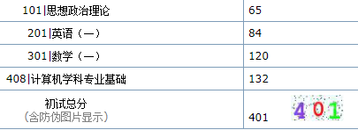
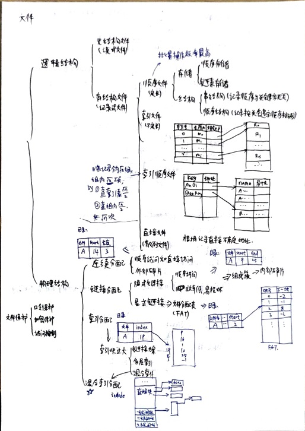
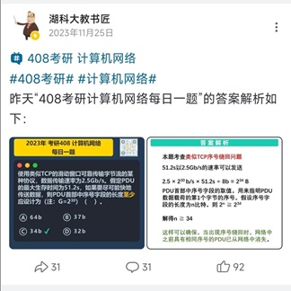
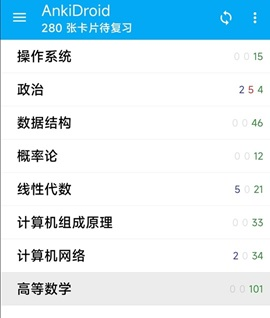

分数：



我估分是在 350-370，没想到结果高这么多。

所以与其说是记录经验不如说是经历，文中没有夸大也没有卖弱的成分，权当是流水账供诸君参考。

### 省流

复习时间：3月开始

资料：
- 政治：徐涛核心考案，肖1000，肖8，肖4
- 英语：黄皮书真题
- 数学：
  - 书：张宇基础30讲，张宇强化36讲，李林880
  - 卷子：李秀芳真题，李林 6 套卷，张宇 8 套卷，李林 4 套卷，张宇 4 套卷
- 408：王道四本书，王道真题，湖科大教书匠每日一题、模拟卷

课程：
- 政治：徐涛马原部分
- 英语：石雷鹏作文
- 数学：梭哈张宇
- 408：除计网都看王道，计网看湖科大教书匠

### 基础

- 本科：华科网安
- 英语：
  - 四级：595
  - 六级：552（听力 218，阅读 197，写作和翻译 137）
- 数学：
  - 微积分：上册 91，下册 78
  - 线性代数：87
- 专业课：

  | 数据结构 | 计组 | 操作系统 | 计网 |
  | -------- | ---- | -------- | ---- |
  | 88       | 85   | 93       | 90   |

- 项目、竞赛
  - 项目：个人认为还可以，感兴趣可以看看[github](https://github.com/yllhwa)。
  - 竞赛：加了我们学院的 CTF 战队，不过我挺菜的，拿的奖比较水（国赛二等奖、祥云杯优胜奖这种基本进线下赛就有的）。当然我认为还是有用的，毕竟水只是在 CTF 这个圈子里面水，在考研这个圈子还是算可以了。

点评：

- 英语：
  - 感谢我的高中英语老师，上大学所有英语考试都是裸考过的。
  - 可以看出我的听力较好，写作偏差。这也和我的高考成绩类似，客观题只扣了 1.5，最后还没上 140。考研英语客观题没错，主观题扣 16 分（倒也算中规中矩，湖北好像算微旱）。
  - 听力对我还有个帮助就是复试听力挺高的，不过占比少拉不开差距，也就按下不表。
- 数学：
  - 基本都是考试周突击的，鉴定为纯纯的飞舞。
  - 此处还有个趣事，大一下的时候第二天就要考微积分了，我深感绝对学不完，四处搜寻取巧之法，还买了个什么三小时突击课程。
- 专业课：
  - 成绩来说中规中矩吧，不过我个人感觉操作系统和计网学得还不错，突击的时候有种亲切的感觉。

### 目标

#### 目标院校上

本校本院无疑是大多数人第一选择，尤其是自知并非头悬梁锥刺股之辈。

于是剩下的选择就是报学硕还是专硕。

常被上岸的学长们挂在嘴边的一句话就是选择大于努力。可惜考研主打的就是一个博弈，我在大一选择分流网安和信安的时候就成为了博弈和从众的牺牲品。

我最后选择的就是本院专硕，从今年的分数来看，学硕是炸穿（350），专硕是爆冷（300）。虽然可能是运气使然，不过我们还是可以尝试从信息差的角度博弈一下。

1. 今年武大网安学硕疯狂缩招到只要 2 人，剩下的难民难免就会涌入华科，武安学冲华安学，合理。
2. 虽然从复试线看去年学专都差不多 330，不过去年专硕考的是英语二，今年改考英语一可能会下降。英语对我影响不大，而部分英语不好的外校考生可能会转考其他英语二的学校，可冲。
3. 很多人会把专硕不提供宿舍作为选择的因素。而部分人不知道华科网安专硕也在网安基地，同样提供宿舍，又赢。

#### 目标分数上

| 政治 | 英语 | 数学 | 408 | 总分 |
| ---- | ---- | ---- | --- | ---- |
| 65   | 65   | 110  | 120 | 360  |

点评：

- 这个目标是在参考了往年的分数线（330 分）而定的，
- 数学：数学算是我从小到大的短板，所以我一开始给自己定的目标就是 110 分。虽然常说“取法乎上，仅得乎中”，但这个目标有时也让我果断地放弃一些性价比低的内容，可能有好处。
- 英语：
  - 英语算是特殊情况，网安专硕今年英语二改考英语一了，这个后面再谈。
  - 英语做套卷能够明显感觉到后面的年份变简单了，所以我后期把目标改成了 70 分。
- 408：
  - 我自认为专业课学得不错，所以一开始就定在了 120 分。

下面分科目讲过程吧。

### 数学

#### 一轮基础（3.1—7.31）

按照经验贴都是先学数学，买了汤家风的书。刚听了一两节课，我们学校的考研群里都在说汤的质量不行，遂又买了张宇的基础 30 讲慢慢开始听课。

这段时间还要上本科的专业课，做课设啥的，所以也挺划水。暑期还有个学校安排的实习，摆了大概两周。还好还有个室友也考研，进度比较之下也算不紧不慢地在学。

这段时间算是磨合期，根据各种信息调整，逐渐形成自己的学习节奏，也没有什么特别的方法论。

**资料**：

张宇基础 30 讲，配套的 300 题，李永乐 660 题（没做多少）。

**学习内容**：

二倍速听一讲张宇的视频课，做这一讲后面的习题和送的基础 300 题上这一讲的内容。

顺序：高数（2 个月）、线代（1 个月）、概率论（1 个月）。

习题正确率：大概一半？好多不会做，只能看了答案才能做。

**学习时长**：

图书馆开馆时间是 8:00—22:00，晚上闭馆回寝室玩游戏，12 点上床玩手机到凌晨一两点，然后睡到第二天 10 点去图书馆。

这段时间中午还会回寝室午休（有时候自己都有点难绷，早上 10 点去图书馆，然后 12 点多又回寝室睡觉），下午 2 点再去图书馆。

抛开吃饭和课间休息（迫真）的时间，一天也学不到多久。

前面进度还和我室友差不多，后来我学高数他学线代，我学线代他学概率论，直接汗流浃背了。

#### 二轮强化（8.4—9.30）

这时候基本自己的学习习惯已经形成了，前面很多东西可能都忘了，不过捡起来很快。

这段时间由于做 880 错误率很高，非常焦虑内耗，天天在知乎搜“880 正确率太低怎么办”🤣。不过还好硬着头皮扛下来了，还能怎么办，只能多学多看。菜，就多练！

顺便一提，知乎上好多水文，硬广，需要自己甄别。

我感觉这种时候，最好不要东一榔头西一棒棰寻找什么能够奇迹般解决问题的资料/网课等等，踏踏实实消化好每一道错题就好。

这段时间还有个离谱的事是跟我一起考研的室友保研保上了，damn，不过对我影响倒不大。感觉还挺好的，前期有个一起敦促你学习的研友，到了这时候离开又避免了陷入比较之中的内耗，你保得好啊！

**资料**：

张宇强化 36 讲，李林 880

**学习内容**：

二倍速听一讲张宇的视频课，做这一讲他没写的例题。

一章听完后做 880 对应习题。

全部写完后又二刷了一遍 880。

880看答案看不懂的可以去 B 站上找讲解视频，看播放量高的就行，还不错。

不过我记得有个 UP 高数讲得不错，线代很多错误，自己甄别吧。

习题正确率：有时候自己画做错的圈圈都笑了，连着几道题都是圈。我后面都是做一道对一道题的答案，对了一道算是运气好。

**学习时长**：

与之前差不多，不过我觉得中午午休有点浪费时间，累了就趴桌子上睡会儿，清醒了继续学。

室友买了个可以趴着睡那种枕头看着也不错。


中午吃太饱了容易困，所以我连着几个月中午都是吃面条，卖苗条窗口的老板都认识我了，有时候去晚了会问为啥今天这么晚（乐）。

#### 三轮冲刺（10.1—考试）

这是大量刷题的阶段

**资料**：

认识三位准备考的保上了（❓），送了我一堆书。所以资料都是捡来用，自己没怎么买。

李艳芳历年真题，李永乐 6 套卷（💩），李林 6 套卷，张宇 8 套卷，李林 4 套卷，张宇 4 套卷

**学习内容**：

定时 3 小时内做一套卷子，做完对答案。

真题做的是 2008 年开始到 2023 年的，前面的没做。

李永乐 6 套卷是最早到的，不然我觉得可能做不到捏着鼻子做完，两个字：滂臭！

李林的卷子和他说的一样：不偏不怪，给我一种考研就会这么考的感觉 🐶（虽然最后考起来感觉不一样，不过分数和李林的平均分一样都是 120）。

张宇的卷子也还可以，虽然据说和往年相比变简单了，不过对我来说有的卷子还是挺难的，平均分 110 吧。

正确率：平均分大概 110 分，在预期水平吧只能说，毕竟真题很多可能在 880 上面见过类似的了，正确率应该会偏高一些。

### 408

#### 一轮基础（7.29—9.1）

我们专业课很多都是大三上学的，都还有印象，所以可以说是伪二轮 🐶？

**资料**：

王道四本书

**学习内容**：

顺序：数据结构->计组->操作系统->计网。

数据结构没看课，后面感觉自己看还是有点吃力，所以还是看王道的视频课。

考研群都说王道计网的课很烂，我看了一点儿，确实 🤣。

所以计网的视频课看的口口相传的 B 站[湖科大教书匠](https://space.bilibili.com/360996402)，还不错。跟王道基本契合，编排上有些小出入，问题不大。

看一节的课，铅笔做后面的习题。很多人 408 第一轮只做选择题。我开得晚，感觉没必要，就连着大题一起做了。错了或者易错的题勾画标记一下。

408 要背的东西还是挺多的，我用 **anki** 记下来背，具体操作后面再谈，强推！

另外一个加强记忆的方法就是思维导图。当然不是每一章都要，例如数据结构这种本身逻辑性就非常强，只需要记忆，就不用再做思维导图了。

我做了导图的就是操作系统的 PV 问题和文件系统。



还有一些易混或者对比的知识点可以用纸笔记录一下，我举例一下我记录的内容供参考：
- 数据结构
  - 图论里的极大连通子图、极小连通子图、强连通分量
  - 图上的各种算法（最短路径、最小生成树、拓扑排序、关键路径、遍历）
  - 各种排序算法
- 计组
  - 存储系统分类（RAM、ROM，易失、非易失）
  - 各种周期（指令周期、机器周期、时钟周期、存储周期）
  - 微指令分类
- 操作系统
  - 死锁必要条件、死锁预防、处理策略、死锁避免、死锁检测与解除
  - 内存管理（连续分配、非连续分配）
- 计网
  - 计网物理层各种编码、接口特性


#### 二轮强化（9.22—10.7）

一轮和二轮之间隔了一段空窗期，是因为数学强化进度偏慢，赶进度去了。

**资料**：

还是王道四本书

**学习内容**：

王道会出一个打卡表，有一些知识点供回忆。

很多内容都忘记了，所以最好再过一遍，我就懒得跟视频课了，快速浏览一遍，熟悉的二刷后面的错题，不熟悉的后面习题全部再做一遍。

由于第一轮基本都理解了，捡起来非常快，计网只用了一天就搞完了。

对于算法题，我的态度是能暴力就暴力吧，最优解还是太难了，特别是对我这种算法一般的人来说。直接暴力启动，拿 9 分走人。

#### 三轮冲刺（10.11—考前）

做卷子

**资料**：

研芝士真题（💩），王道真题，王道模拟题（💩），湖科大教书匠每日一题、模拟卷

**学习内容**：

研芝士真题是保的研友送的，不仅答案烂，题目也有错的。

由于王道后面的题很多真题，每道题基本过了两三遍了，所以真题做起来应该无压力。平均分大概 135，不过这个真题的平均分挺虚的。选择题错了超过 2 个我都有种想扇自己的冲动（❌）。

真题做完一遍开始做王道的模拟题，给我做得想暴打出题人，每做完一套都让人不经感叹：世间竟还有如此大便的题目？

还是捏着鼻子做完了，毕竟 408 王道算是最大的机构了，当补充知识、查漏补缺也还将就用。

做完又刷了一遍真题，这次在答题卡上完全按照考试要求和答案给分点写、评一遍，同时每道题都想想关联的知识点，有遗忘的回去再熟悉。

湖科大教书匠的 B 站账号每天都会更新一道计网题，最后几个周还会更新计网的模拟卷，质量都非常高，基本覆盖了易错易混点、遗忘点和知识补充等，值得一做。



### 英语

#### 单词：

墨墨背单词，词本《2024 考研英语词汇闪过》Word List 从上到下。

从 3 月开始背，一天背 100-200 个，最后背了 2094 个（一共 5500），后期没背了（说起来高考 3500 词也没背完）。

不过词库里面分了高频词、中频词、低频词、偶考词等，我把高频词和中频词背完了。

总体来说这个墨墨还是好用。

可能每个人阅读的方式不同，我从高中开始就没背完单词，对生词忍耐度很高。不过偶尔还是会碰到单纯因为单词不认识而丢分的题目。尤其是翻译，由于一开始只做完型和阅读没有察觉，后面做翻译才发现这么多单词不认识怎么翻译？

所以单词还是尽量背完比较好，我算是运气好今年翻译的单词基本都认识。

#### 完型、阅读：

没看课，直接做黄皮书真题，很多人先不做完型，我觉得没必要，当开胃菜做还是不错。

一开始完型基本扣 3 分，阅读每篇错一个 😵。不过做到后面明显感觉越做越简单了，一是可能题目确实在变简单，二是熟练度上来了。最后考研对答案客观题没错，只扣了主观题的分。

新题型没怎么做，做了一些真题感觉难度不大。

翻译尝试看了下课，感觉没啥作用，遂放弃。这里体现了单词没背完的短板，很多单词不认识没法翻译，只能猜。

#### 作文：

跟了几节石雷鹏的课，还行，比较适合我这种平均分选手。自己尝试整理了一套模板放手机便签里面背下来。感觉最大的问题是好久没碰英语，单复数、过去式这些经常无意间就忽略了。不过后来把模板搞好了也就还行，反正作文目标是拿平均分。

模板附上供参考：

```
This is a simple yet though-provoking/inspiring picture.
In/On/Inside/In front of _________, there is a _________, _________.
Finally, the caption of this picture can be noticed, which reads “”.

Obviously, this picture focus on a common situation/trend/virtue in contemporary society that an increasing number of people are _____.
This situation/trend/virtue is particularly worth concerning/praising for the reason that they pay excessive attention to _____, ignoring the significance of _____.

From my perspective, it is _____ that enable us to enjoy a positive atmosphere.
_____ will give us strength, arouse our passion for life and help us get better.
Just as a saying goes, _____.
It is no exaggeration to say that _____ plays an indispensable role not only in our personal well-being, but also in national progress and world peace.

In general, everyone should keep in mind that _____. Futhermore, it is advisable for us to deliver this positive energy to people around us, so as to fill the world with vitality. The society as a whole should shape a positive atmosphere to advocate public virtues.
```

### 政治

政治还差点才到平均分，难绷。

资料：徐涛核心考案，肖秀荣背诵手册。

听了徐涛马原的课，上苍盾小程序刷肖 1000（有种 NTR 的感觉）。刷完了上面可以刷错题。

最后刷肖八，背肖四。肖四给我背晕了，最后只背下来两套。我整个考研期间最怀疑自己考不上的就是拿到肖四开背的时候。

反正上考场写满了，得个平均分差不多得了。

### 碎碎念

#### 设备

平板买了一个三星 Tab S8，不过我不习惯在平板上写写画画，所以最后也就拿来看网课视频。比起在手机上看还是舒服一点。

#### 软件

##### 番茄 ToDo

挺好用，季卡也不贵。

我开始时用番茄时间 35 分钟，后面进入状态了就全部用正向计时，学累了就休息会儿。

后面开始做卷子了拿来计时也不错。

对前期习惯的养成应该算是有帮助，后期拿来当个计时器也不错。

##### AnkiDroid

可以说相当实用，我数学、408、政治都在上面写了卡片来背。

就跟背单词软件一样，记录在本子上不是不行，而是麻烦、复习不方便。

记录在 Anki 上面可以自动编排复习计划，可以当成积累本和错题本来用。

可以记录资料的页数或者拍照，不会浪费时间在记录上。

俗话说好记性不如烂笔头，但是整理太浪费时间了，所以我觉得这个软件挺好的，
要注意的就是复习的时候自己不熟悉的一定要点不熟悉，让算法捞起来再给你背，反复加强。



有个问题是不知道为啥卡片多了之后整个程序卡卡的，我也没找到解决方法，可能升级后好一点吧。

##### 百度网盘

虽然我书全部买的正版，不过有时候真的是当正版受害者，这些个书的 APP 体验一个比一个烂。最后还是在百度网盘的那种资料群看的（懒得找公众号啥的，我 pdd 九块九直接买的）。

##### 游戏

平常和朋友一起玩儿游戏，他们经常说感觉我不像个考研的，难绷。

考研这一年把 CSGO 打上 1000 小时了，文明 6 更是重量级。

总之自己把控吧，初始考前几天我还在联机文明 6 （想知道怎么联机方便的可以看我另一篇文章）呢，背肖 4 背自闭了。

### 复试
我初试是排专硕第二名，第一名410分。最后复试分数我反超了这个同学，这何尝不是一种逆袭呢（？）。

复试考得还挺杂，上机算法、汇编和计网安全的笔试、英语听力、综合面试。

不过说实话复试只用了不到一个周的闲暇时间来准备，毕竟汇编和计网安全还记得一些。

具体复试题目和内容就不谈了。

### 联系我

1. 评论区留言
2. 私信
3. 邮箱：contact@yllhwa.com
4. 线下真人快打（？）
