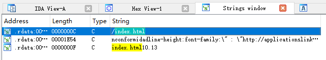
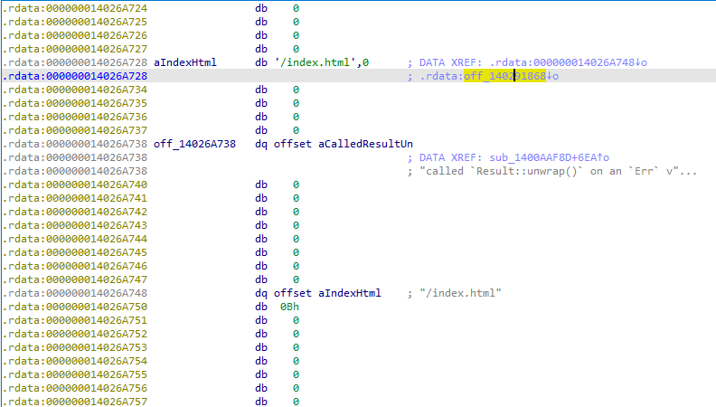
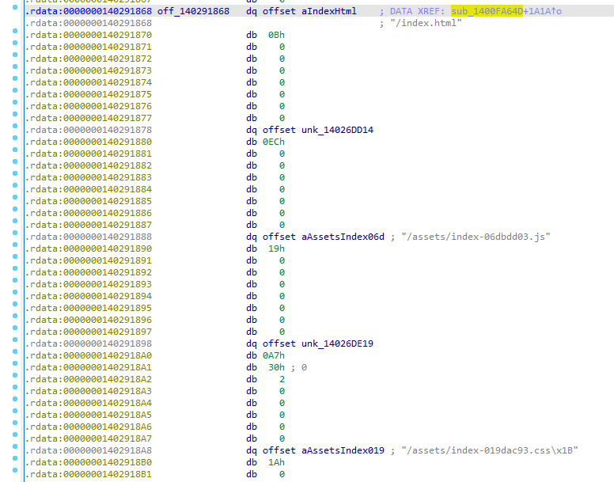
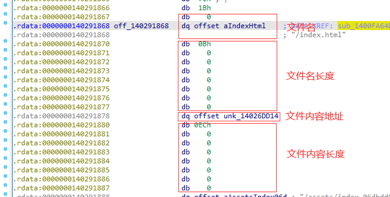
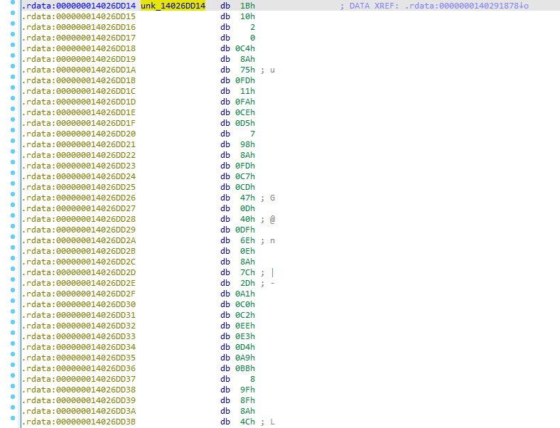

Tauri 是一个帮助开发人员使用现有的任何前端框架制作应用程序的工具包，其核心由 Rust 驱动。与 Electron 相比，Tauri 复用了系统的 Webview，使得包体积很小。

Electron 的静态资源提取较为简单，使用相关工具对 asar 文件进行解包即可。而 Tauri 直接将静态资源打包在了可执行文件中，使得提取相对比较麻烦。

查阅 Tauri 的源码，容易找到将静态资源打包的代码（https://github.com/tauri-apps/tauri/blob/dev/core/tauri-codegen/src/embedded_assets.rs）。

```rust
#[cfg(not(feature = "compression"))]
{
use std::io::Write;
out_file
  .write_all(&input)
  .map_err(|error| EmbeddedAssetsError::AssetWrite {
    path: path.to_owned(),
    error,
  })?;
}

#[cfg(feature = "compression")]
{
let mut input = std::io::Cursor::new(input);
// entirely write input to the output file path with compression
brotli::BrotliCompress(&mut input, &mut out_file, &Self::compression_settings()).map_err(
  |error| EmbeddedAssetsError::AssetWrite {
    path: path.to_owned(),
    error,
  },
)?;
}
```

可见 Tauri 会根据配置文件中是否开启压缩来打包静态资源文件，若压缩选项开启（默认情况），其会使用 brotli 算法对资源进行压缩后再打包。

了解原理后，我们就可以开始进行静态分析。笔者在 Windows 下进行了分析，其他平台应该类似。

使用 IDA 打开一个 Tauri 程序。由于去除了符号，代码的可读性很差。我们尝试从字符串入手，查找`index.html`。



进入第一个出现的位置，查看引用。在其第二个引用处我们可以发现端倪。



此处看起来很像是一个包含文件名和文件位置的表。



稍加分析我们即可得知这个表的结构如图：



将对应文件内容的部分 dump 出来进行 brotli 解压缩即可。



一个可用的解压 python 脚本如下：

```python
import brotli

content = open("dump.br", "rb").read()
print(len(content))

decompressed = brotli.decompress(content)
open("dump", "wb").write(decompressed)
```

注意 brotli 对文件的完整性要求似乎很高，多一个或少一个字节都会报错。

回压缩替换的时候需要注意，Tauri 选择的压缩等级为 9。

```python
import brotli

content = open("dump", "rb").read()

compressed = brotli.compress(content, quality=9)
print(len(compressed))
open("my.br", "wb").write(compressed)
```

参考：
Reverse Engineering a Native Desktop Application (Tauri App)
https://infosecwriteups.com/reverse-engineering-a-native-desktop-application-tauri-app-5a2d92772da5