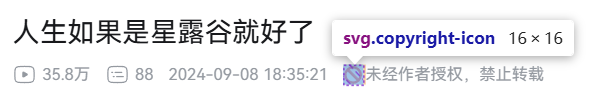
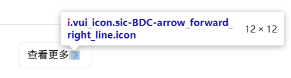

在前端开发中，图标和文字的对齐是一个常见的问题，影响 UI 的整洁性和可读性。图标没对齐看起来是一个很小很细节的问题，却往往会让用户感觉到「别扭」或者「哪里不对劲」，降低对网站的信任感。

以 B 站为例，网站中处处可以看到没有对齐的图标。





可以看出这些地方是缺少基本的设计、测试和质量管控的，B 站的 UI 细节管理存在一定的问题。

## Web 中图标的实现
在网页开发中，图标（icon）的实现方式多种多样，每种方式各有优缺点，并且对齐方式有不同的处理方法。

### 字体图标
**常见库：** FontAwesome、阿里巴巴矢量库（iconfont）、Material Icons

#### 实现方式
字体图标本质上是一个特殊的字体，每个图标对应一个字符编码。

```html
<i class="fa fa-home"></i> 主页
```

```css
.icon::before {
  content: "\f015"; /* Unicode */
  font-family: "FontAwesome";
}
```

#### 优点
- ✅ 体积小：多个图标可以合并到一个 `woff2` 字体文件中，减少 HTTP 请求。
- ✅ 矢量缩放：不会失真，适用于不同分辨率的屏幕。
- ✅ 易于修改颜色和大小：可以直接用 `color`、`font-size` 控制。

#### 缺点
- ❌ 对齐问题：字体图标的 baseline 可能会和文本对不齐，需要手动调整 vertical-align。
- ❌ 不易控制细节：和真正的 SVG 相比，字体图标在形状、渐变等方面的控制力较弱。

#### 对齐方式
如果图标偏移，可以手动调整：
```css
.icon {
  vertical-align: middle;
  font-size: 1em;
}
```
如果 `vertical-align` 不够精准，`display: flex` 是更好的选择：
```css
.icon-text {
  display: flex;
  align-items: center;
  gap: 4px;
}
```

### SVG 图标
SVG（Scalable Vector Graphics）是最灵活的图标实现方式，主要有两种用法：内联 SVG（inline SVG） 和 外部 SVG 文件（`` 引用）。

#### （1）内联 SVG
```svg
<svg width="24" height="24" viewBox="0 0 24 24">
  <path d="M12 2L15 8H9L12 2Z" fill="black"/>
</svg>
```
##### 优点
- ✅ 灵活性高：可以直接修改 SVG 的 `fill`、`stroke`、`width`、`height` 等属性，支持动画。
- ✅ 可以直接嵌入在 HTML 中，不需要额外的 HTTP 请求。

##### 缺点
- ❌ 体积较大：每个 SVG 都是一个 XML 文件，如果有很多图标，会增加 HTML 文件的体积，降低整洁度。

#### （2）外部 SVG 文件
```html

```
或者
```css
background-image: url('icon.svg');
```

##### 优点
- ✅ 减少 HTML 代码量，适用于大量重复使用的图标。
- ✅ 可以用 CDN 加载，提升性能。

##### 缺点
- ❌ 无法直接用 CSS 修改颜色（`fill` 不能控制 `` 加载的 SVG）。
- ❌ 对齐可能出现问题：`img` 默认是 `inline`，会受到 `baseline` 影响。

#### SVG 对齐方式
如果是 `inline SVG`，可以使用 `vertical-align: middle`：
```css
svg {
  vertical-align: middle;
}
```
如果是 `` 引用的 SVG，建议用 `display: block` 避免 `baseline` 影响：
```css
img {
  display: block;
}
```
或者放在 flexbox 里对齐：
```css
.icon-text {
  display: flex;
  align-items: center;
}
```

### CSS 伪元素（::before / ::after）
#### 实现方式
```css
.button::before {
  content: "🔍";
  font-size: 1.2em;
  margin-right: 4px;
}
```
或者
```css
.button::before {
  content: "";
  display: inline-block;
  background-image: url('icon.svg');
  width: 16px;
  height: 16px;
}
```
#### 优点： 
- ✅ 不需要额外标签，HTML 结构更干净。
- ✅ 可以使用 `background-image` 处理复杂图标。

#### 缺点
- ❌ 不支持 `alt` 文本，不利于无障碍访问。
- ❌ 对齐仍可能需要 `vertical-align` 或 `flexbox` 调整。

#### 对齐方式
```css
.button::before {
  display: inline-block;
  vertical-align: middle;
}
```

### CSS 图片精灵
CSS Sprite 是将多个小图标合并到一个图片文件中，通过 `background-position` 来显示不同的图标。

#### 实现方式
```css
.icon {
  background-image: url('sprite.png');
  background-position: -16px -16px;
  width: 16px;
  height: 16px;
}
```

#### 优点
- ✅ 减少 HTTP 请求，提升性能。

#### 缺点
- ❌ 不易维护：需要手动维护图片精灵，添加新图标时需要修改 CSS。
- ❌ 对齐问题：`background-position` 可能不够精确，需要手动调整。
- ❌ 不易修改颜色：无法直接修改颜色。

## 总结
在大多数情况下，使用 `flexbox` 是最通用、最省心的方式，因为它可以让图标和文字自然对齐，而不用依赖 `vertical-align` 这种容易受 `line-height` 和 `baseline` 影响的属性。