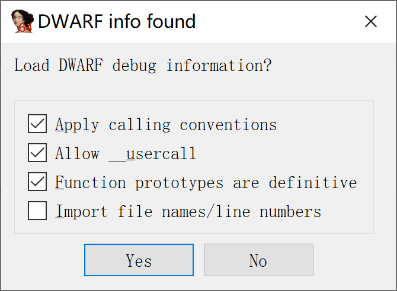
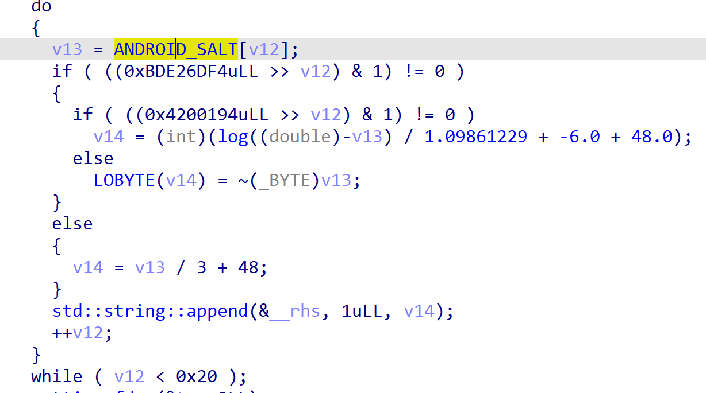

其实已经很久不玩儿原神了，也就没怎么跟进米游社的逆向。最近看到有群友又在问，加上米游社的 so 层保护确实有点儿意思，就粗浅看了下。

整理了一些米游社带给我的思考，今后应该是不会再深钻逆向这块儿了，学前端去力。

### 被遗忘的架构与 DWARF

书接上回，米游社的 so 层是加了很多花指令的，包括但不限于动态跳转、控制流平坦化等。

<!-- more -->

另外，我分析 so 层的时候总是喜欢分析 armv7 的，因为这个架构比较通用，汇编看起来相对亲切些。不过之前鬼迷心窍，我突然想打开 arm64 架构的 so 看看，结果不看不知道，一看吓一跳。

当打开 ida 给我弹出了是否导入 DWARF 信息的时候，我就知道，事情没有这么简单。

众所周知，DWARF 携带了大量的调试信息，可以给逆向工作带来极大的便利。再次找到目标函数，清晰明了的函数结构跃然眼前，甚至贴心地标出了所有函数名。

自作聪明的 salt 解密也显得苍白。

### 被遗忘的宿主

虽然已经走到了核心地带，我还是懒到懒得去研究他的算法，是时候派出万能的内存搜索大法了。

没想到这米游社还挺牛，objection 一附加上去就闪退了。

这时常规的思路大概是要找找其检测方法与之对抗云云，可惜我还是太懒了。如开始所说，我逆向这玩意儿不能给我带来任何好处，只是玩儿玩儿的心态。玩就要有玩的态度，`Never wrestle with pigs. You both get dirty and the pig likes it.`

根据我的经验，在这个 so 里面没有对环境进行检测。在其他地方检测，直接把 so 拆出来自己调用不就完了。

新建一个安卓 native 项目，同时添加一个与调用该 so 相同的类。

什么打包都懒得配置，直接编译出来，把 so 替换掉再重新签名，就实现了对其进行调用，接下来内存 dump、hook、动态调试可就随心所欲了。

当然，米游社的这种情况比较少见，一般业务 so 里面多多少少还是有点儿检测的。

### 总结

最近做了不少逆向相关的工作，纯属兴趣，这个米游社给我们保护代码的启发就是

- 不要忘记其他可能泄露信息的地方，如本例中的 arm64 so 忘记保护，甚至没有 trip 调试信息。
- 业务代码最好还是和验证代码、反调试代码交叉混合，最绝的就是业务代码依赖验证代码和反调试代码的中间结果。这样至少能稍微增加逆向的难度，也避免了一键 patch 掉保护代码的尴尬。