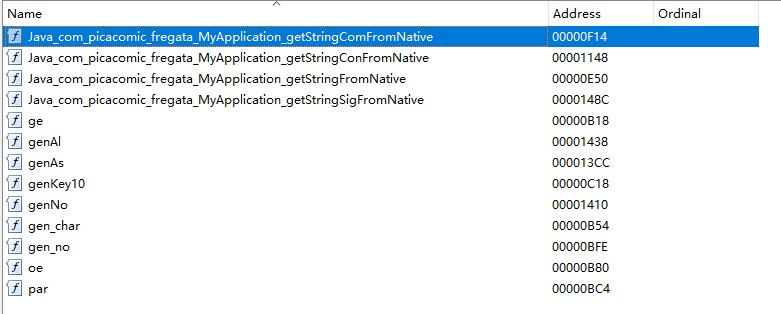

最近看了一丢丢安卓逆向的知识，想找个东西练练手，于是就盯上了著名的粉红色软件-PicAcg。

获取 apk，拆开一看，没有加固。签名后安装，闪退。判断是存在签名效验。
使用 MT 管理器的去除签名校验功能后安装，依然闪退。同时注意到`lib`文件夹中唯一的一个 so 文件`libJniTest.so`。猜测是存在 so 签名校验。
<!-- more -->
使用 MT 管理器反编译`class.dex`，搜索`native`，找到属于程序的代码 (`com.picacomic.fregata`)。
发现方法`getStringComFromNative()`、`getStringConFromNative()`和`getStringSigFromNative()`，进一步验证猜想。


发现这些方法都存在于 MyApplication 中，于是进入 MyApplication，代码量不多，反编译之 (转成 java)。容易看到两个关键的方法：

```java
public boolean bz()
{
    StringBuilder sb = new StringBuilder();
    sb.append(getStringComFromNative());
    sb.append("");
    return sb.toString().equalsIgnoreCase("1");
}
public String c(String[] strArr)
{
    if(this.hl == null)
    {
        this.hl = new d();
    }
    String str = "";
    for(int i = 0; i < strArr.length; i++)
    {
        str = str + strArr[i] + ", ";
    }
    f.D(TAG, "RAW parameters = " + str);
    String stringConFromNative = getStringConFromNative(strArr);
    f.D(TAG, "CONCAT parameters = " + stringConFromNative);
    String stringSigFromNative = getStringSigFromNative();
    f.D(TAG, "CONCAT KEY = " + stringSigFromNative);
    return this.hl.C(stringConFromNative, getStringSigFromNative());
}
```

其中 c() 方法似乎是返回拼接的字符串，而 bz() 方法则返回了一个`bool`变量。猜测 bz() 方法为签名效验所依赖的方法，于是搜索 bz() 方法被调用的地方。

可以看到`SplashActivity`中的 bZ() 方法是重新定义的 (.method 为定义方法)，故重点关注`g`中的调用。反编译之，代码量有点大，搜索 bz 迅速定位到关键方法 ar()。

```java
public static boolean ar(Context context)
{
    try
    {
        throw new Exception("blah");
    }
    catch(Exception e)
    {
        for(StackTraceElement stackTraceElement: e.getStackTrace())
        {
            if(stackTraceElement.getClassName().contains(
                    "xposed") || stackTraceElement.getMethodName()
                .contains("xposed") || stackTraceElement.getClassName()
                .contains("Xposed") || stackTraceElement.getMethodName()
                .contains("Xposed"))
            {
                return false;
            }
        }
        if(MyApplication.bx().bz())
        {
            return true;
        }
        ((Activity) context).finish();
        return false;
    }
}
```

可以看到甚至出现了`xposed`，几乎可以断定此方法就是防破解的关键。
我们可以将此函数在汇编中改为直接返回 true。

```ARM Assembly
.method public static ar(Landroid/content/Context;)Z
    .registers 8

    const/4 v1, 0x1

    return v1
.end method
```

修改完成后 app 已经不闪退了，但是发现在断网情况下不闪退，而联网进行操作即会闪退，推测服务端还对签名进行了校验，故重心转移到`libJniTest.so`上。为了方便，选用通用性最好的`armeabi-v7a`文件夹中的 so 文件。(不同的文件夹是给不同架构的平台编译的，其中 armeabi-v7a 最为通用)

丢入 IDA 中分析。
查看`Exports`窗口容易发现刚才看到的几个关键函数。


注意到`getStringComFromNative`函数刚才在 apk 中我们已经过了，故首先关注`getStringConFromNative`函数。
F5 反编译之，得到伪 C 代码。我的重点不在逆向出算法，故关注点放在关键的判断上。

```c
if ( j_genKey10(a1, a2) )
{
    strcpy(v19, v37);
    strcat(v19, v7);
    strcat(v19, v35);
    strcat(v19, v36);
    v20 = v8;
    v21 = v19;
}
else
{
    strcpy(v19, v8);
    strcat(v19, v10);
    strcat(v19, v37);
    strcat(v19, v34);
    strcat(v19, v7);
    strcat(v19, v36);
    strcat(v19, v33);
    v21 = v19;
    v20 = v35;
}
```

此处似乎会根据` j_genKey10()`的返回值进行不同的字符串拼接操作。可以点击进入` j_genKey10()`发现其在获取 app 信息，也可以直接猜测其在判断签名是否正确。
直接反其道而行，选中 if 按 Tab 回到流程图窗口，定位到关键汇编语句

```ARM Assembly
CBZ             R0, loc_12F4
```

查阅资料得知

> BEQ 指令是“相等（或为 0）跳转指令”，
> BNE 指令是“不相等（或不为 0）跳转指令”，
> B 指令是“无条件跳转指令”，
> CBZ 指令是“比较，为零则跳转”，
> CBNZ 指令是“比较，为非零则跳转”。<br>
> BNE 跳转指令对应的 HEX 机器码是 D1，
> BEQ 跳转指令对应的 HEX 机器码是 D0，
> CBZ 跳转指令对应的 HEX 机器码是 B1，
> CBNZ 跳转指令对应的 HEX 机器码是 B9。

只要把 CBZ 改为 CBNZ 即可。
点击 view->Open subviews->Hex dump，已经选中了关键的地方。

使用 WinHex 搜索前后随意一段定位，将 B1 改为 B9 即可。
注：搜索 16 进制而不是文本，修改时用方向键定位到目标位置直接输入值即可修改对应的值。

回到 IDA 重新打开可以看到已经修改成功了。

接下来对`getStringFromNative`,`getStringSigFromNative`两个函数进行相似的操作即可 (修改 BEQ 为 BNE)

接下来把修改后的 so 文件传回手机，用 MT 管理器替换 apk 包中的即可。我删除了除 armeabi-v7a 的文件夹，再将 so 放入其中。
再次打包安装可以发现已经可以正常使用 app，至此签名校验去除完成。
