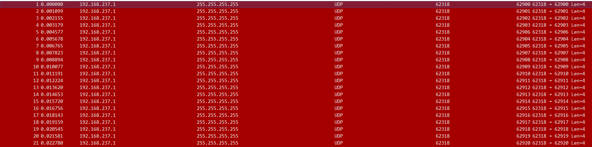
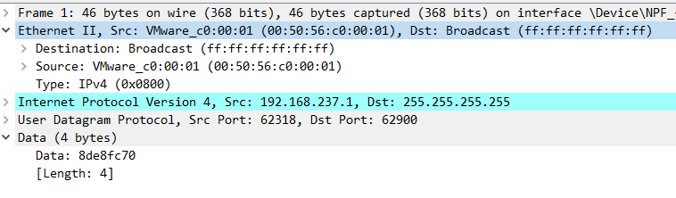
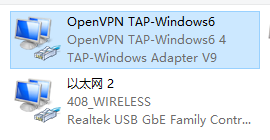

阅读本文您需要了解 Linux 的基本操作，以及一些基本的网络知识。

众所周知，文明 6 的联机体验有时直让人想国粹，不过其联机的游戏性确实又还不错。于是在消耗若干小时的迭代体验后我打算记录下一些体验与最终选定的方案供大家参考。

<!-- more -->

### 文明 6 的局域网联机实现方式

在谈论联机方式之前，我想先谈谈文明 6 局域网联机的实现方式。简单用 WireShark 抓包看看，我们可以得知，其采用了发送广播包的方式寻找局域网中可用主机的方式，且向 62900-62999 端口都发送了，估计是防止端口占用的情况。

再看看包内容，可以发现这既是一个二层广播包，又是一个三层广播包（什么是二层广播和三层广播请自行搜索）。

了解了文明 6 搜索局域网服务器的方式后我们就能有的放矢地寻找局域网联机地工具了。

### Windows 的广播实现方式

我们知道，二层组网大部分是通过一个 TAP 设备形成一个虚拟网卡实现的。

而 Windows 的广播实现方式竟然是只在其中一个，而且通常是用来上网的那个网卡上进行广播！也就是说即便你和小伙伴完成了组网，互相能够 Ping 通了，Windows 也不会把文明 6 的局域网广播包给你广播过去。

抛开 Windows 这样设计的想法不谈，要解决这个问题也很简单，只需要安装[WinIPBroadcast](https://github.com/dechamps/WinIPBroadcast)这款开源软件即可，这款软件的原理是监听所有网卡上的广播包，然后把这些广播包发送到所有的网卡上，自然也包括了用来组网的虚拟网卡。

下面简单说下市面上有的联机方案吧，我这里只说我用过的，不过大概原理也就这几种。

### P2P 打洞局域网联机
这种方式的代表软件有 ZeroTier、Tailscale、N2N 等，他们的原理都是通过一系列的打洞操作实现两台电脑之间的直连，从而实现局域网联机。这种方式的优点是不需要服务器参与，延迟可以做到很低，带宽方面的限制也很小。

但是考虑我们每次大概有 4-8 人不等需要联机，每个人的网络状况都非常复杂。有的人更是重量级的 NAT4（教育网）。此外，文明 6 似乎对网络波动异常地敏感，一旦出现连接不同步的情况，各种异常、等待、掉线就会接踵而至。而恰恰 P2P 打洞就不是一种非常稳定可靠的方式，所以这种方式很快就被我们淘汰了。

当然，在一起游玩的人比较少、网络环境比较好的情况下，这种方式还是可以尝试的。因此我还是大概讲讲。

首先我们要知道，ZeroTier（闭源）和 N2N（开源）都是**二层**网络互通的，而 Tailscale（部分开源）是基于 WireGuard 的**三层**网络互通。因此，理论上来说 Tailscale 和 WireGuard 在默认配置下是无法进行文明 6 局域网联机的的。但是笔者在玄学的情况下也用 WireGuard 成功联机了几次，具体原因我暂且蒙在鼓里，现在也无法复现了。所以，如果你想尝试 P2P 联机的话，我是比较推荐使用 ZeroTier 和 N2N 的，具体配置请参考网络上的其他教程。

### VPN 组网

好的，现在来到我们目前的组网方法。考虑到文明 6 对网络波动的敏感性以及对网络带宽、延迟的不敏感性，我们使用传统的组网方式就能实现稳定可用的联机，而最简单可靠的组网莫过于`OpenVPN`。

要使用这个方法，你肯定首先需要一台服务器，我用的是一台腾讯云北京的 8Mbps 服务器。

配置 OpenVPN 服务端的方法有很多，我就不再赘述了，此处列出几个教程，这几个教程用的是`kylemanna/openvpn`这个 docker image，配置起来比较方便，环境也不太容易出问题。

- https://zhuanlan.zhihu.com/p/497357782
- https://www.jianshu.com/p/598577e4a752
- https://zhuanlan.zhihu.com/p/440346670

### 更进一步？

用 VPN 组网实际上的延迟是`客户端->服务器->房主`的延迟，因此服务器最好离双方都比较近，例如我在武汉，ping 北京的服务器 42ms，最后游戏中的延迟也就是 80 多 ms，这个距离算是比较远了，一些延迟敏感的游戏肯定玩不了。

文明 6 没有提供填写服务器 IP 来游戏的方式，比较糟心，但是如果房主有公网 IP（或者 IPV6）的话，可以在每个人 PC 上写一个程序把广播包修改下，目的 IP 地址改成服务端的即可，其实我之前简单实现了个，不过没有实践，就不献丑了，仅仅是提供一个思路。

笔者用 VPN 的方式组网，实测可以 8 人文明联机超过 4 个小时没有任何问题。希望大家都能找到适合自己的联机方式，愉快地和小伙伴 PVP 吧！
